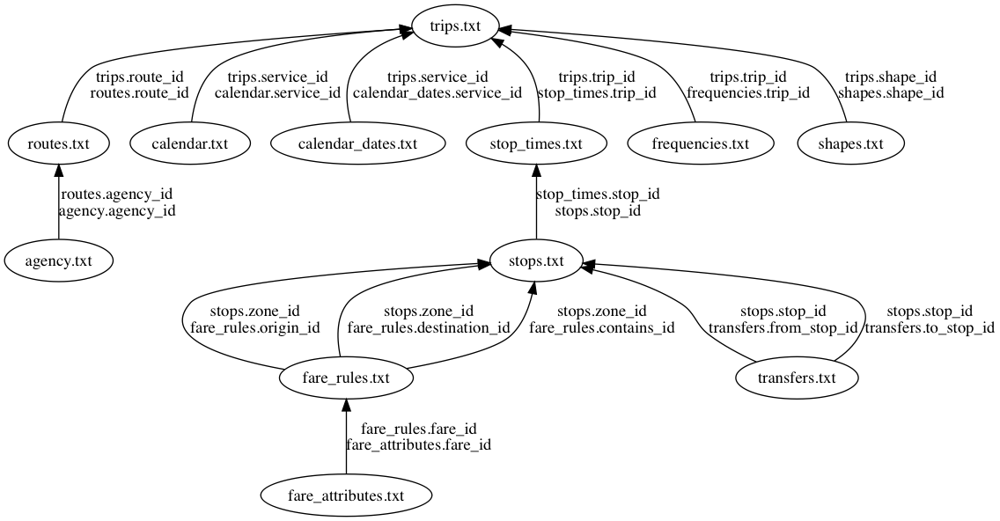

# Partridge

Partridge is python library for working with [GTFS](https://developers.google.com/transit/gtfs/) feeds using [pandas](https://pandas.pydata.org/) DataFrames.

The implementation of Partridge is heavily influenced by our experience at [Remix](https://www.remix.com/) ingesting, analyzing, and debugging thousands of GTFS feeds from hundreds of agencies.

At the core of Partridge is a dependency graph rooted at `trips.txt`. When reading the contents of a feed, disconnected data is pruned away according to this graph. The root node can optionally be filtered to create a view of the feed specific to your needs. It's most common to filter a feed down to specific dates (`service_id`), routes (`route_id`), or both.



## Usage

```python
import datetime
import partridge as ptg

path = 'path/to/sfmta-2017-08-22.zip'

service_ids_by_date = ptg.read_service_ids_by_date(path)

feed = ptg.feed(path, view={
    'trips.txt': {
        'service_id': service_ids_by_date[datetime.date(2017, 9, 25)],
        'route_id': '12300', # 18-46TH AVENUE
    },
})

assert set(feed.trips.service_id) == service_ids_by_date[datetime.date(2017, 9, 25)]
assert list(feed.routes.route_id) == ['12300']

# Buses running the 18 - 46th Ave line use 88 stops (on September 25, 2017, at least).
assert len(feed.stops) == 88
```

## Features

- First-class support for resolving calendar days
- Built on pandas DataFrames
- Reduced memory footprint by reading+filtering+pruning files from disk *in chunks*.
- Handle nested folders in zips
- Simple, no-surprises type conversions
- Highly configurable (TODO: document config)

## Installation

```console
pip install partridge
```

## Thank You

I hope you find this library useful. If you have suggestions for improving Partridge, please open an issue on GitHub.
