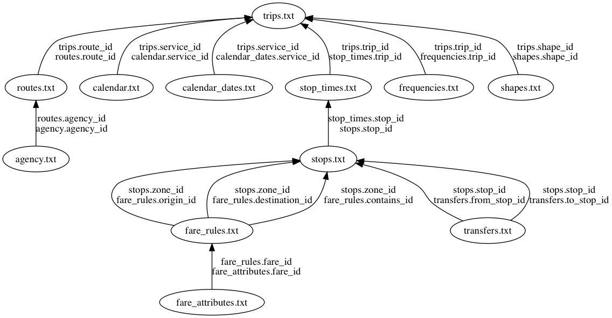

=========
Partridge
=========

.. image:: https://img.shields.io/pypi/v/partridge.svg
        :target: https://pypi.python.org/pypi/partridge

.. image:: https://img.shields.io/travis/remix/partridge.svg
        :target: https://travis-ci.org/remix/partridge

Partridge is a Python 3.6+ library for working with `GTFS <https://developers.google.com/transit/gtfs/>`__ feeds using `pandas <https://pandas.pydata.org/>`__ DataFrames.

Partridge is heavily influenced by our experience at `Remix <https://www.remix.com/>`__ analyzing and debugging every GTFS feed we could find.

At the core of Partridge is a dependency graph rooted at ``trips.txt``. Disconnected data is pruned away according to this graph when reading the contents of a feed.

Feeds can also be filtered to create a view specific to your needs. It's most common to filter a feed down to specific dates (``service_id``) or routes (``route_id``), but any field can be filtered.

Philosphy
---------

The design of Partridge is guided by the following principles:

**As much as possible**

- Favor speed
- Allow for extension
- Succeed lazily on expensive paths
- Fail eagerly on inexpensive paths

**As little as possible**

- Do anything other than efficiently read GTFS files into DataFrames
- Take an opinion on the GTFS spec

Installation
------------

.. code:: console

    pip install partridge

**GeoPandas support**

.. code:: console

    pip install partridge[full]

Usage
-----

**Setup**

.. code:: python

    import partridge as ptg

    inpath = 'path/to/caltrain-2017-07-24/'

Inspecting the calendar
~~~~~~~~~~~~~~~~~~~~~~~

**The date with the most trips**

.. code:: python

    date, service_ids = ptg.read_busiest_date(inpath)
    #  datetime.date(2017, 7, 17), frozenset({'CT-17JUL-Combo-Weekday-01'})

**The week with the most trips**

.. code:: python

    service_ids_by_date = ptg.read_busiest_week(inpath)
    #  {datetime.date(2017, 7, 17): frozenset({'CT-17JUL-Combo-Weekday-01'}),
    #   datetime.date(2017, 7, 18): frozenset({'CT-17JUL-Combo-Weekday-01'}),
    #   datetime.date(2017, 7, 19): frozenset({'CT-17JUL-Combo-Weekday-01'}),
    #   datetime.date(2017, 7, 20): frozenset({'CT-17JUL-Combo-Weekday-01'}),
    #   datetime.date(2017, 7, 21): frozenset({'CT-17JUL-Combo-Weekday-01'}),
    #   datetime.date(2017, 7, 22): frozenset({'CT-17JUL-Caltrain-Saturday-03'}),
    #   datetime.date(2017, 7, 23): frozenset({'CT-17JUL-Caltrain-Sunday-01'})}

**Dates with active service**

.. code:: python

    service_ids_by_date = ptg.read_service_ids_by_date(path)

    date, service_ids = min(service_ids_by_date.items())
    #  datetime.date(2017, 7, 15), frozenset({'CT-17JUL-Caltrain-Saturday-03'})

    date, service_ids = max(service_ids_by_date.items())
    #  datetime.date(2019, 7, 20), frozenset({'CT-17JUL-Caltrain-Saturday-03'})

**Dates with identical service**

.. code:: python

    dates_by_service_ids = ptg.read_dates_by_service_ids(inpath)

    busiest_date, busiest_service = ptg.read_busiest_date(inpath)
    dates = dates_by_service_ids[busiest_service]

    min(dates), max(dates)
    #  datetime.date(2017, 7, 17), datetime.date(2019, 7, 19)

Reading a feed
~~~~~~~~~~~~~~

.. code:: python

    _date, service_ids = ptg.read_busiest_date(inpath)

    view = {
        'trips.txt': {'service_id': service_ids},
        'stops.txt': {'stop_name': 'Gilroy Caltrain'},
    }

    feed = ptg.load_feed(path, view)

**Read shapes and stops as GeoDataFrames**

.. code:: python

    service_ids = ptg.read_busiest_date(inpath)[1]
    view = {'trips.txt': {'service_id': service_ids}}

    feed = ptg.load_geo_feed(path, view)

    feed.shapes.head()
    #       shape_id                                           geometry
    #  0  cal_gil_sf  LINESTRING (-121.5661454200744 37.003512297983...
    #  1  cal_sf_gil  LINESTRING (-122.3944115638733 37.776439059278...
    #  2   cal_sf_sj  LINESTRING (-122.3944115638733 37.776439059278...
    #  3  cal_sf_tam  LINESTRING (-122.3944115638733 37.776439059278...
    #  4   cal_sj_sf  LINESTRING (-121.9031703472137 37.330157067882...

    minlon, minlat, maxlon, maxlat = feed.stops.total_bounds
    #  -122.412076, 37.003485, -121.566088, 37.77639

Extracting a new feed
~~~~~~~~~~~~~~~~~~~~~

.. code:: python

    outpath = 'gtfs-slim.zip'

    view = {'trips.txt': {'service_id': ptg.read_busiest_date(inpath)[1]}}

    ptg.extract_feed(inpath, outpath, view)
    feed = ptg.load_feed(outpath)

    assert service_ids == set(feed.trips.service_id)

Features
--------

-  Surprisingly fast :)
-  Load only what you need into memory
-  Built-in support for resolving service dates
-  Easily extended to support fields and files outside the official spec
   (TODO: document this)
-  Handle nested folders and bad data in zips
-  Predictable type conversions

Thank You
---------

I hope you find this library useful. If you have suggestions for
improving Partridge, please open an `issue on
GitHub <https://github.com/remix/partridge/issues>`__.
